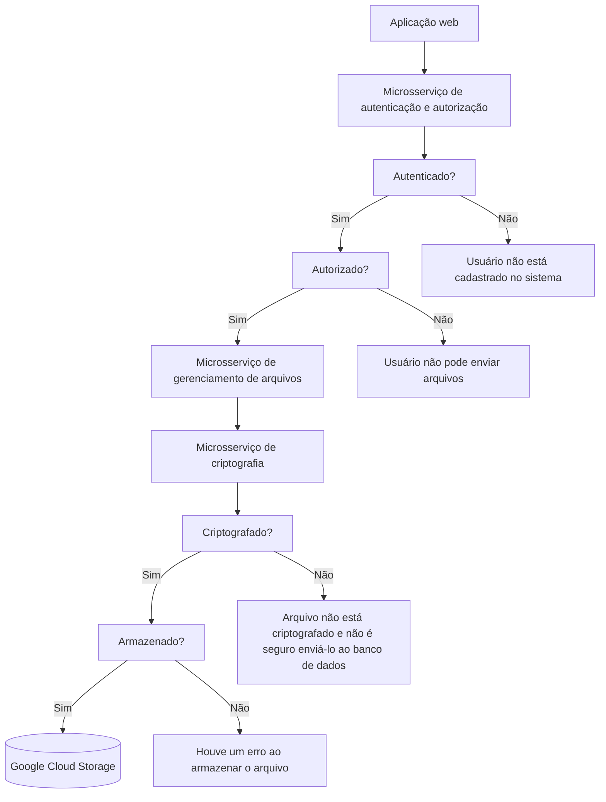
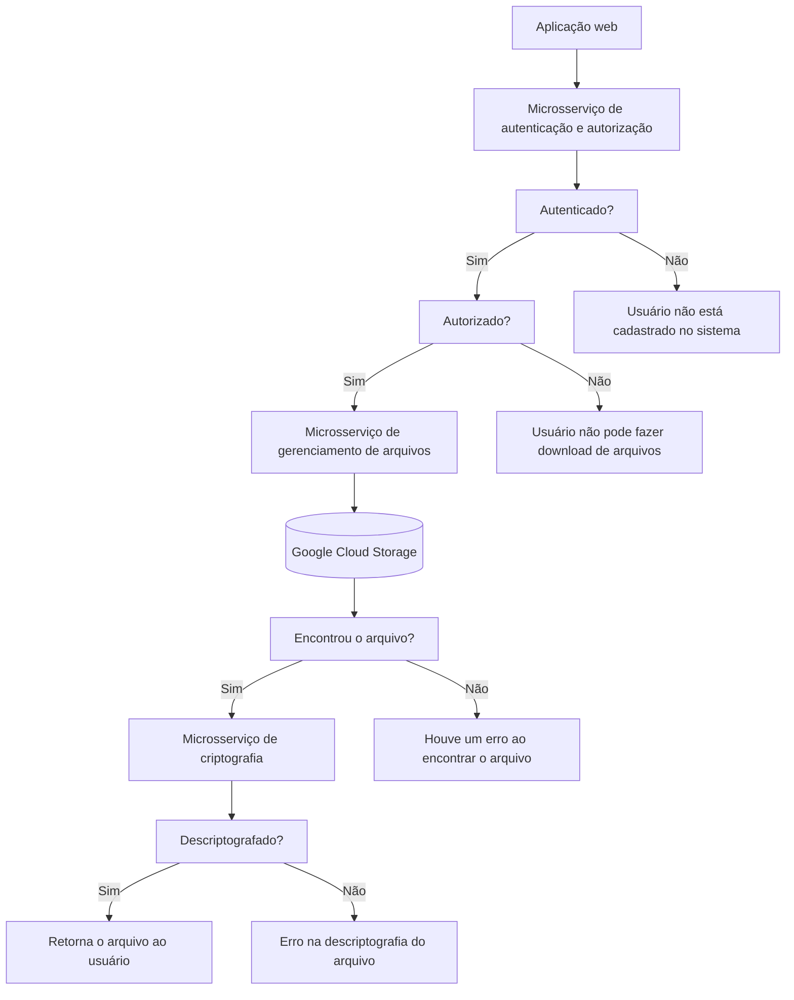

# Cloud File Sharing Platform

Plataforma de compartilhamento de arquivos segura em nuvem

## Funcionamento da aplicação

### Envio de arquivos

### Download de arquivos

## Estrutura

### Microsserviços

#### Serviço de autenticação e autorização

Responsável por autenticar usuários e fornecer autorização para realizar operações como
upload, download e compartilhamento de arquivos.

#### Serviço de gerenciamento de arquivos

Responsável pela lógica central de gerenciamento de arquivos, incluindo armazenamento,
recuperação, exclusão e compartilhamento de arquivos.

#### Serviço de criptografia

Este serviço pode ser responsável pela criptografia e descriptografia dos arquivos,
garantindo a segurança dos dados durante o trânsito e repouso.

### Containers

Cada microsserviço será encapsulado em um container, isolando o ambiente de execução e
tornando a aplicação portátil.

### APIs

São a ponte entre os microsserviços e o frontend da aplicação. Cada microsserviço terá uma
API RESTful para interagir com o frontend.

### Frontend

O frontend será uma aplicação web, contida em um container, onde o usuário poderá fazer
login, fazer upload, download e compartilhar arquivos.

### Armazenamento

Será utilizado um sistema de armazenamento em nuvem, como Amazon S3 ou Google Cloud
Platform. Eles são escaláveis e seguros.

## Possíveis melhorias

[ ] - Compactação dos arquivos para que eles consumam menos espaço
[ ] - Uso de ferramentas para balanceamento de carga
