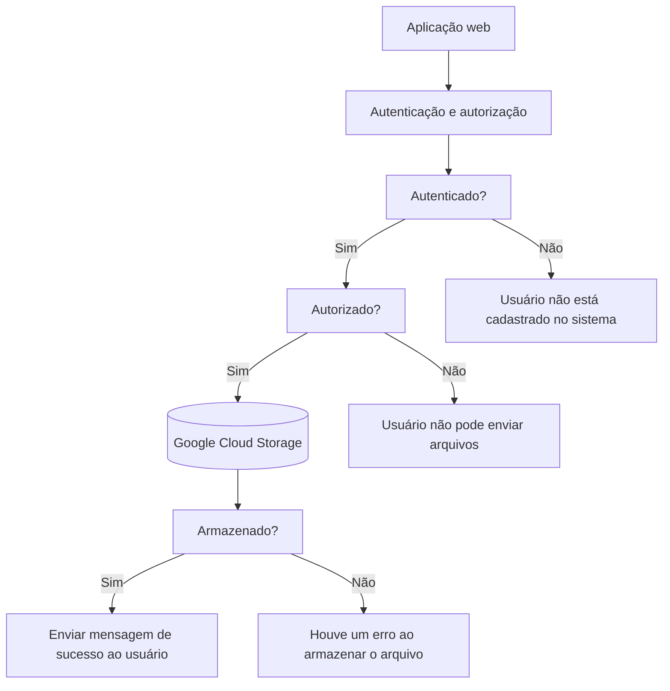
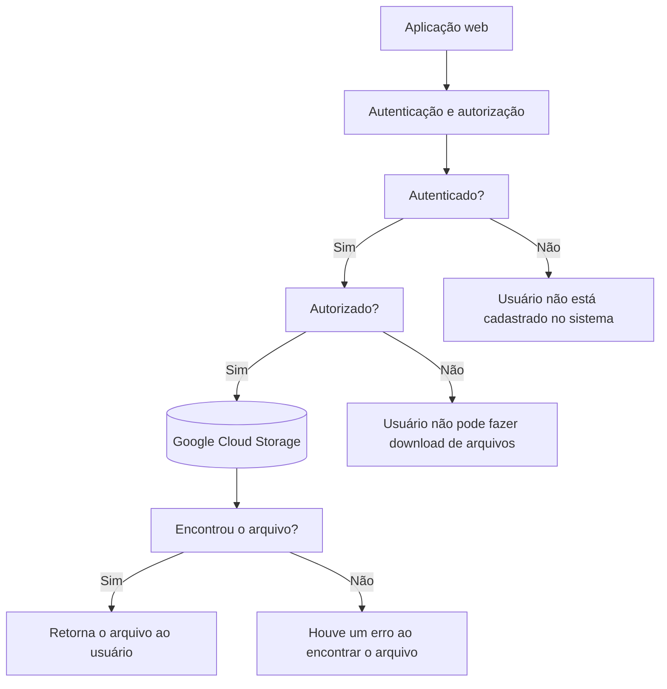

# Backend

## Funcionamento da aplicação

### Envio de arquivos

```mermaid
flowchart TD
    frontend[Aplicação web]
    auth[Autenticação e autorização]
    database[(Google Cloud Storage)]

    frontend --> auth
    auth --> ask[Autenticado?]
    ask --> |Sim| ask2[Autorizado?]
    ask --> |Não| problem[Usuário não está cadastrado no sistema]
    ask2 --> |Sim| database
    ask2 --> |Não| problem2[Usuário não pode enviar arquivos]
    database --> ask3[Armazenado?]
    ask3 --> |Sim| answer[Enviar mensagem de sucesso ao usuário]
    ask3 --> |Não| problem3[Houve um erro ao armazenar o arquivo]
```

### Download de arquivos

```mermaid
flowchart TD
    frontend[Aplicação web]
    auth[Autenticação e autorização]
    database[(Google Cloud Storage)]

    frontend --> auth
    auth --> ask[Autenticado?]
    ask --> |Sim| ask2[Autorizado?]
    ask --> |Não| problem[Usuário não está cadastrado no sistema]
    ask2 --> |Sim| database
    ask2 --> |Não| problem2[Usuário não pode fazer download de arquivos]
    database --> ask3[Encontrou o arquivo?]
    ask3 --> |Sim| answer[Retorna o arquivo ao usuário]
    ask3 --> |Não| problem3[Houve um erro ao encontrar o arquivo]
```
